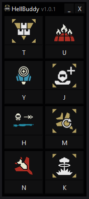

</a>

# HellBuddy
HellBuddy is a macro software for the game HELLDIVERS 2 that inputs stratagems for you at the press of a button.

HellBuddy includes a minimalist GUI, where stratagem macros and their respective keybinds can be easily rebound in just a few clicks. This allows you to change your setup to match your stratagem loadout on the fly with very few clicks required. HellBuddy is currently only compatible with Windows.

# Optimization

HellBuddy was made using the Qt framework in C++, and was designed to be lightweight and use as little system resources as possible. It will use very little memory and CPU, and shouldn't effect your FPS at all.

# How to download / use HellBuddy

1. On the right hand side of this page, click the latest release
2. Download the .zip file
3. Right click on the folder and click extract all
4. Run 'HellBuddy.exe'
5. Ensure that the 'Open Stratagem List' keybind is set to left ctrl, and the stratagem direction keybinds are set to the arrow keys (If you don't want to do this, the keycodes that HellBuddy uses can be changed in helldivers_keybinds.json)
7. Press the hotkey underneath a stratagem to activate the respective stratagem in-game
8. Change the stratagems by clicking on them
9. Change the hotkeys by clicking on them and pressing the new keybind

# How can I contribute to this project?

Please contact me on Discord if you want to make a contribution! Here are steps for how to setup the project on your machine
1. Ensure that the latest version of qt creator is installed.
2. Clone the repo
3. Build the project
4. Move everything from /JsonData into your build folder
5. Build the project again

# Videos

Showcase: https://www.youtube.com/watch?v=uEuhH0oc6Zs 
How to download and use HellBuddy: https://www.youtube.com/watch?v=nnpVVKC2aq4

